Development Indicators 2017-Part 1
================

-   <a href="#introduction" id="toc-introduction">Introduction</a>
-   <a href="#exploratory-data-analysis"
    id="toc-exploratory-data-analysis">Exploratory data analysis</a>
    -   <a href="#structure" id="toc-structure">Structure</a>
    -   <a href="#qualtity-of-data" id="toc-qualtity-of-data">Qualtity of
        Data</a>
        -   <a href="#missing-values" id="toc-missing-values">Missing Values</a>
        -   <a href="#outliers-and-errors" id="toc-outliers-and-errors">Outliers and
            Errors</a>
-   <a href="#exploration-of-the-univariate-and-multivariate-distribution"
    id="toc-exploration-of-the-univariate-and-multivariate-distribution">Exploration
    of the univariate and multivariate distribution</a>
    -   <a href="#univariate-analysis" id="toc-univariate-analysis">Univariate
        Analysis</a>
    -   <a href="#multivariate-analysis"
        id="toc-multivariate-analysis">Multivariate Analysis</a>
        -   <a href="#income-categories" id="toc-income-categories">Income
            Categories</a>
        -   <a href="#co2-and-income" id="toc-co2-and-income">CO2 and income</a>
        -   <a href="#unemployement-by-gender"
            id="toc-unemployement-by-gender">Unemployement by gender</a>
        -   <a href="#mortality" id="toc-mortality">Mortality</a>
        -   <a href="#access-to-electricity-map"
            id="toc-access-to-electricity-map">Access to electricity Map</a>
        -   <a href="#arable-land-map" id="toc-arable-land-map">Arable Land Map</a>
        -   <a href="#education-expenditure-map"
            id="toc-education-expenditure-map">Education expenditure Map</a>

# Introduction

This project sets out to explore the data published by the World Bank at
<https://data.worldbank.org/1>, which contains the 2017 values of a
selection of ‘global development indicators’ for 68 countries. Each
observation in this dataset corresponds to a single country, and most of
the variables correspond to a development indicator. In particular, the
data contains 14 variables:

-   `country` : Name of country.
-   `region` : Geographical region.
-   `income` : Income category, as specified by the World Bank.
-   `GDP.percap` : GDP per capita (current USD).
-   `Market.Cap.pcntGDP` : Market capitalization of domestic listed
    companies (% of GDP).
-   `Unemployment.female` : Unemployment, female (% of female labour
    force) .
-   `Unemployment.male` : Unemployment, male (% of male labour force).
-   `Education.Expend` : Government expenditure on education, total (%
    of GDP).
-   `Arable.Land.pcnt` : Arable Land (% of land area).
-   `Life.Expect.female` : Life expectancy at birth.
-   `Life.Expect.male` : Life expectancy at birth, male (years).
-   `Mortality.u5` : The number of children who die by the age of 5
    years, per 1000 live births.
-   `CO2.emiss.mtpercap` : CO2 emissions (metric tons per capita).
-   `Access2Elec.pcnt` : Access to electricity (% of population).

# Exploratory data analysis

## Structure

Our dataset has 68 observations and 14 variables as mentioned above. The
first three variables are characters while the rest of the variables are
continuous numeric values.
<table>
<thead>
<tr>
<th style="text-align:left;">
country
</th>
<th style="text-align:left;">
region
</th>
<th style="text-align:left;">
income
</th>
<th style="text-align:right;">
GDP.percap
</th>
<th style="text-align:right;">
Market.Cap.pcntGDP
</th>
<th style="text-align:right;">
Unemployment.female
</th>
<th style="text-align:right;">
Unemployment.male
</th>
<th style="text-align:right;">
Education.Expend
</th>
<th style="text-align:right;">
Arable.Land.pcnt
</th>
<th style="text-align:right;">
Life.Expect.female
</th>
<th style="text-align:right;">
Life.Expect.male
</th>
<th style="text-align:right;">
Mortality.u5
</th>
<th style="text-align:right;">
CO2.emiss.mtpercap
</th>
<th style="text-align:right;">
Access2Elec.pcnt
</th>
</tr>
</thead>
<tbody>
<tr>
<td style="text-align:left;">
United Arab Emirates
</td>
<td style="text-align:left;">
Middle East & North Africa
</td>
<td style="text-align:left;">
High income
</td>
<td style="text-align:right;">
40644.791
</td>
<td style="text-align:right;">
60.1920579
</td>
<td style="text-align:right;">
7.111
</td>
<td style="text-align:right;">
1.472000
</td>
<td style="text-align:right;">
NA
</td>
<td style="text-align:right;">
0.6265841
</td>
<td style="text-align:right;">
79.008
</td>
<td style="text-align:right;">
76.966
</td>
<td style="text-align:right;">
7.2
</td>
<td style="text-align:right;">
21.9506143
</td>
<td style="text-align:right;">
100.00000
</td>
</tr>
<tr>
<td style="text-align:left;">
Argentina
</td>
<td style="text-align:left;">
Latin America & Caribbean
</td>
<td style="text-align:left;">
Upper middle income
</td>
<td style="text-align:right;">
14613.042
</td>
<td style="text-align:right;">
16.8948426
</td>
<td style="text-align:right;">
9.473
</td>
<td style="text-align:right;">
7.528000
</td>
<td style="text-align:right;">
5.45432
</td>
<td style="text-align:right;">
14.3238730
</td>
<td style="text-align:right;">
79.726
</td>
<td style="text-align:right;">
72.924
</td>
<td style="text-align:right;">
10.3
</td>
<td style="text-align:right;">
4.0894715
</td>
<td style="text-align:right;">
100.00000
</td>
</tr>
<tr>
<td style="text-align:left;">
Austria
</td>
<td style="text-align:left;">
Europe & Central Asia
</td>
<td style="text-align:left;">
High income
</td>
<td style="text-align:right;">
47312.006
</td>
<td style="text-align:right;">
36.1929246
</td>
<td style="text-align:right;">
5.032
</td>
<td style="text-align:right;">
5.912000
</td>
<td style="text-align:right;">
5.37189
</td>
<td style="text-align:right;">
16.1044595
</td>
<td style="text-align:right;">
84.000
</td>
<td style="text-align:right;">
79.400
</td>
<td style="text-align:right;">
3.6
</td>
<td style="text-align:right;">
7.4827515
</td>
<td style="text-align:right;">
100.00000
</td>
</tr>
<tr>
<td style="text-align:left;">
Australia
</td>
<td style="text-align:left;">
East Asia & Pacific
</td>
<td style="text-align:left;">
High income
</td>
<td style="text-align:right;">
53934.250
</td>
<td style="text-align:right;">
113.6846991
</td>
<td style="text-align:right;">
5.670
</td>
<td style="text-align:right;">
5.520000
</td>
<td style="text-align:right;">
5.12790
</td>
<td style="text-align:right;">
3.9979095
</td>
<td style="text-align:right;">
84.600
</td>
<td style="text-align:right;">
80.500
</td>
<td style="text-align:right;">
3.8
</td>
<td style="text-align:right;">
15.7386474
</td>
<td style="text-align:right;">
100.00000
</td>
</tr>
<tr>
<td style="text-align:left;">
Barbados
</td>
<td style="text-align:left;">
Latin America & Caribbean
</td>
<td style="text-align:left;">
High income
</td>
<td style="text-align:right;">
17391.669
</td>
<td style="text-align:right;">
67.3145842
</td>
<td style="text-align:right;">
8.778
</td>
<td style="text-align:right;">
8.468000
</td>
<td style="text-align:right;">
4.36638
</td>
<td style="text-align:right;">
16.2790698
</td>
<td style="text-align:right;">
80.307
</td>
<td style="text-align:right;">
77.562
</td>
<td style="text-align:right;">
13.4
</td>
<td style="text-align:right;">
4.1924473
</td>
<td style="text-align:right;">
100.00000
</td>
</tr>
<tr>
<td style="text-align:left;">
Bangladesh
</td>
<td style="text-align:left;">
South Asia
</td>
<td style="text-align:left;">
Lower middle income
</td>
<td style="text-align:right;">
1563.768
</td>
<td style="text-align:right;">
34.5114059
</td>
<td style="text-align:right;">
6.710
</td>
<td style="text-align:right;">
3.335000
</td>
<td style="text-align:right;">
NA
</td>
<td style="text-align:right;">
59.5938388
</td>
<td style="text-align:right;">
73.978
</td>
<td style="text-align:right;">
70.409
</td>
<td style="text-align:right;">
34.2
</td>
<td style="text-align:right;">
0.4929066
</td>
<td style="text-align:right;">
88.00000
</td>
</tr>
<tr>
<td style="text-align:left;">
Belgium
</td>
<td style="text-align:left;">
Europe & Central Asia
</td>
<td style="text-align:left;">
High income
</td>
<td style="text-align:right;">
44089.310
</td>
<td style="text-align:right;">
87.2928335
</td>
<td style="text-align:right;">
7.058
</td>
<td style="text-align:right;">
7.118000
</td>
<td style="text-align:right;">
6.42534
</td>
<td style="text-align:right;">
27.6089828
</td>
<td style="text-align:right;">
83.900
</td>
<td style="text-align:right;">
79.200
</td>
<td style="text-align:right;">
4.1
</td>
<td style="text-align:right;">
8.1554911
</td>
<td style="text-align:right;">
100.00000
</td>
</tr>
<tr>
<td style="text-align:left;">
Bahrain
</td>
<td style="text-align:left;">
Middle East & North Africa
</td>
<td style="text-align:left;">
High income
</td>
<td style="text-align:right;">
23742.937
</td>
<td style="text-align:right;">
61.1893688
</td>
<td style="text-align:right;">
3.837
</td>
<td style="text-align:right;">
0.483000
</td>
<td style="text-align:right;">
2.32452
</td>
<td style="text-align:right;">
2.0512821
</td>
<td style="text-align:right;">
78.143
</td>
<td style="text-align:right;">
76.188
</td>
<td style="text-align:right;">
7.3
</td>
<td style="text-align:right;">
20.3336240
</td>
<td style="text-align:right;">
100.00000
</td>
</tr>
<tr>
<td style="text-align:left;">
Brazil
</td>
<td style="text-align:left;">
Latin America & Caribbean
</td>
<td style="text-align:left;">
Upper middle income
</td>
<td style="text-align:right;">
9928.676
</td>
<td style="text-align:right;">
46.2664552
</td>
<td style="text-align:right;">
14.718
</td>
<td style="text-align:right;">
11.369000
</td>
<td style="text-align:right;">
6.32048
</td>
<td style="text-align:right;">
6.6715800
</td>
<td style="text-align:right;">
79.156
</td>
<td style="text-align:right;">
71.804
</td>
<td style="text-align:right;">
15.4
</td>
<td style="text-align:right;">
2.1644215
</td>
<td style="text-align:right;">
99.80000
</td>
</tr>
<tr>
<td style="text-align:left;">
Canada
</td>
<td style="text-align:left;">
North America
</td>
<td style="text-align:left;">
High income
</td>
<td style="text-align:right;">
45129.356
</td>
<td style="text-align:right;">
143.5220535
</td>
<td style="text-align:right;">
5.851
</td>
<td style="text-align:right;">
6.781000
</td>
<td style="text-align:right;">
NA
</td>
<td style="text-align:right;">
4.2951998
</td>
<td style="text-align:right;">
84.000
</td>
<td style="text-align:right;">
79.900
</td>
<td style="text-align:right;">
5.2
</td>
<td style="text-align:right;">
15.3852910
</td>
<td style="text-align:right;">
100.00000
</td>
</tr>
<tr>
<td style="text-align:left;">
Switzerland
</td>
<td style="text-align:left;">
Europe & Central Asia
</td>
<td style="text-align:left;">
High income
</td>
<td style="text-align:right;">
83352.089
</td>
<td style="text-align:right;">
239.3965223
</td>
<td style="text-align:right;">
5.063
</td>
<td style="text-align:right;">
4.572000
</td>
<td style="text-align:right;">
4.95157
</td>
<td style="text-align:right;">
10.0765183
</td>
<td style="text-align:right;">
85.600
</td>
<td style="text-align:right;">
81.600
</td>
<td style="text-align:right;">
4.2
</td>
<td style="text-align:right;">
4.5694192
</td>
<td style="text-align:right;">
100.00000
</td>
</tr>
<tr>
<td style="text-align:left;">
Cote d’Ivoire
</td>
<td style="text-align:left;">
Sub-Saharan Africa
</td>
<td style="text-align:left;">
Lower middle income
</td>
<td style="text-align:right;">
2111.027
</td>
<td style="text-align:right;">
24.2026471
</td>
<td style="text-align:right;">
3.870
</td>
<td style="text-align:right;">
2.860000
</td>
<td style="text-align:right;">
3.80348
</td>
<td style="text-align:right;">
11.0062893
</td>
<td style="text-align:right;">
58.320
</td>
<td style="text-align:right;">
55.864
</td>
<td style="text-align:right;">
86.0
</td>
<td style="text-align:right;">
0.4247575
</td>
<td style="text-align:right;">
65.60000
</td>
</tr>
<tr>
<td style="text-align:left;">
Chile
</td>
<td style="text-align:left;">
Latin America & Caribbean
</td>
<td style="text-align:left;">
High income
</td>
<td style="text-align:right;">
14998.817
</td>
<td style="text-align:right;">
106.3678182
</td>
<td style="text-align:right;">
7.462
</td>
<td style="text-align:right;">
6.602000
</td>
<td style="text-align:right;">
5.41966
</td>
<td style="text-align:right;">
1.7242029
</td>
<td style="text-align:right;">
82.333
</td>
<td style="text-align:right;">
77.333
</td>
<td style="text-align:right;">
7.4
</td>
<td style="text-align:right;">
4.7123958
</td>
<td style="text-align:right;">
99.70000
</td>
</tr>
<tr>
<td style="text-align:left;">
China
</td>
<td style="text-align:left;">
East Asia & Pacific
</td>
<td style="text-align:left;">
Upper middle income
</td>
<td style="text-align:right;">
8816.987
</td>
<td style="text-align:right;">
70.7634243
</td>
<td style="text-align:right;">
3.853
</td>
<td style="text-align:right;">
4.913000
</td>
<td style="text-align:right;">
3.66745
</td>
<td style="text-align:right;">
12.6785033
</td>
<td style="text-align:right;">
78.828
</td>
<td style="text-align:right;">
74.315
</td>
<td style="text-align:right;">
9.2
</td>
<td style="text-align:right;">
7.1749480
</td>
<td style="text-align:right;">
100.00000
</td>
</tr>
<tr>
<td style="text-align:left;">
Colombia
</td>
<td style="text-align:left;">
Latin America & Caribbean
</td>
<td style="text-align:left;">
Upper middle income
</td>
<td style="text-align:right;">
6376.707
</td>
<td style="text-align:right;">
38.9495245
</td>
<td style="text-align:right;">
11.502
</td>
<td style="text-align:right;">
6.865000
</td>
<td style="text-align:right;">
4.53551
</td>
<td style="text-align:right;">
5.4249662
</td>
<td style="text-align:right;">
79.694
</td>
<td style="text-align:right;">
74.124
</td>
<td style="text-align:right;">
14.6
</td>
<td style="text-align:right;">
1.5551062
</td>
<td style="text-align:right;">
98.50000
</td>
</tr>
<tr>
<td style="text-align:left;">
Costa Rica
</td>
<td style="text-align:left;">
Latin America & Caribbean
</td>
<td style="text-align:left;">
Upper middle income
</td>
<td style="text-align:right;">
12225.574
</td>
<td style="text-align:right;">
4.9751435
</td>
<td style="text-align:right;">
10.290
</td>
<td style="text-align:right;">
6.820000
</td>
<td style="text-align:right;">
7.06981
</td>
<td style="text-align:right;">
4.9255778
</td>
<td style="text-align:right;">
82.557
</td>
<td style="text-align:right;">
77.354
</td>
<td style="text-align:right;">
8.7
</td>
<td style="text-align:right;">
1.6525403
</td>
<td style="text-align:right;">
99.60000
</td>
</tr>
<tr>
<td style="text-align:left;">
Cyprus
</td>
<td style="text-align:left;">
Europe & Central Asia
</td>
<td style="text-align:left;">
High income
</td>
<td style="text-align:right;">
26608.875
</td>
<td style="text-align:right;">
12.3405769
</td>
<td style="text-align:right;">
11.265
</td>
<td style="text-align:right;">
10.865000
</td>
<td style="text-align:right;">
5.75417
</td>
<td style="text-align:right;">
10.2088745
</td>
<td style="text-align:right;">
82.794
</td>
<td style="text-align:right;">
78.547
</td>
<td style="text-align:right;">
2.8
</td>
<td style="text-align:right;">
6.1880926
</td>
<td style="text-align:right;">
100.00000
</td>
</tr>
<tr>
<td style="text-align:left;">
Germany
</td>
<td style="text-align:left;">
Europe & Central Asia
</td>
<td style="text-align:left;">
High income
</td>
<td style="text-align:right;">
44542.295
</td>
<td style="text-align:right;">
61.4445107
</td>
<td style="text-align:right;">
3.317
</td>
<td style="text-align:right;">
4.129000
</td>
<td style="text-align:right;">
4.88274
</td>
<td style="text-align:right;">
33.6949366
</td>
<td style="text-align:right;">
83.400
</td>
<td style="text-align:right;">
78.700
</td>
<td style="text-align:right;">
3.9
</td>
<td style="text-align:right;">
8.8582937
</td>
<td style="text-align:right;">
100.00000
</td>
</tr>
<tr>
<td style="text-align:left;">
Algeria
</td>
<td style="text-align:left;">
Middle East & North Africa
</td>
<td style="text-align:left;">
Lower middle income
</td>
<td style="text-align:right;">
4109.698
</td>
<td style="text-align:right;">
0.2076133
</td>
<td style="text-align:right;">
18.415
</td>
<td style="text-align:right;">
8.315000
</td>
<td style="text-align:right;">
6.50538
</td>
<td style="text-align:right;">
3.1367000
</td>
<td style="text-align:right;">
77.735
</td>
<td style="text-align:right;">
75.307
</td>
<td style="text-align:right;">
24.3
</td>
<td style="text-align:right;">
3.5057477
</td>
<td style="text-align:right;">
99.61514
</td>
</tr>
<tr>
<td style="text-align:left;">
Egypt, Arab Rep. 
</td>
<td style="text-align:left;">
Middle East & North Africa
</td>
<td style="text-align:left;">
Lower middle income
</td>
<td style="text-align:right;">
2444.290
</td>
<td style="text-align:right;">
19.7452044
</td>
<td style="text-align:right;">
22.749
</td>
<td style="text-align:right;">
8.127000
</td>
<td style="text-align:right;">
NA
</td>
<td style="text-align:right;">
2.9242742
</td>
<td style="text-align:right;">
73.967
</td>
<td style="text-align:right;">
69.453
</td>
<td style="text-align:right;">
21.7
</td>
<td style="text-align:right;">
2.4749439
</td>
<td style="text-align:right;">
100.00000
</td>
</tr>
<tr>
<td style="text-align:left;">
Spain
</td>
<td style="text-align:left;">
Europe & Central Asia
</td>
<td style="text-align:left;">
High income
</td>
<td style="text-align:right;">
28100.586
</td>
<td style="text-align:right;">
67.8866149
</td>
<td style="text-align:right;">
19.022
</td>
<td style="text-align:right;">
15.654000
</td>
<td style="text-align:right;">
4.20778
</td>
<td style="text-align:right;">
24.5297408
</td>
<td style="text-align:right;">
86.100
</td>
<td style="text-align:right;">
80.600
</td>
<td style="text-align:right;">
3.3
</td>
<td style="text-align:right;">
5.6540396
</td>
<td style="text-align:right;">
100.00000
</td>
</tr>
<tr>
<td style="text-align:left;">
France
</td>
<td style="text-align:left;">
Europe & Central Asia
</td>
<td style="text-align:left;">
High income
</td>
<td style="text-align:right;">
38685.258
</td>
<td style="text-align:right;">
106.2027715
</td>
<td style="text-align:right;">
9.374
</td>
<td style="text-align:right;">
9.444000
</td>
<td style="text-align:right;">
5.45160
</td>
<td style="text-align:right;">
33.7213605
</td>
<td style="text-align:right;">
85.700
</td>
<td style="text-align:right;">
79.600
</td>
<td style="text-align:right;">
4.3
</td>
<td style="text-align:right;">
4.7275756
</td>
<td style="text-align:right;">
100.00000
</td>
</tr>
<tr>
<td style="text-align:left;">
Greece
</td>
<td style="text-align:left;">
Europe & Central Asia
</td>
<td style="text-align:left;">
High income
</td>
<td style="text-align:right;">
18536.191
</td>
<td style="text-align:right;">
25.3849319
</td>
<td style="text-align:right;">
26.117
</td>
<td style="text-align:right;">
17.851999
</td>
<td style="text-align:right;">
3.47221
</td>
<td style="text-align:right;">
16.5865012
</td>
<td style="text-align:right;">
83.900
</td>
<td style="text-align:right;">
78.800
</td>
<td style="text-align:right;">
4.3
</td>
<td style="text-align:right;">
6.2112500
</td>
<td style="text-align:right;">
100.00000
</td>
</tr>
<tr>
<td style="text-align:left;">
Croatia
</td>
<td style="text-align:left;">
Europe & Central Asia
</td>
<td style="text-align:left;">
High income
</td>
<td style="text-align:right;">
13629.290
</td>
<td style="text-align:right;">
40.4963655
</td>
<td style="text-align:right;">
11.908
</td>
<td style="text-align:right;">
10.608000
</td>
<td style="text-align:right;">
3.90567
</td>
<td style="text-align:right;">
14.4371797
</td>
<td style="text-align:right;">
80.900
</td>
<td style="text-align:right;">
74.900
</td>
<td style="text-align:right;">
4.8
</td>
<td style="text-align:right;">
4.2380576
</td>
<td style="text-align:right;">
100.00000
</td>
</tr>
<tr>
<td style="text-align:left;">
Hungary
</td>
<td style="text-align:left;">
Europe & Central Asia
</td>
<td style="text-align:left;">
High income
</td>
<td style="text-align:right;">
14623.697
</td>
<td style="text-align:right;">
22.0446330
</td>
<td style="text-align:right;">
4.573
</td>
<td style="text-align:right;">
3.813000
</td>
<td style="text-align:right;">
4.61973
</td>
<td style="text-align:right;">
47.3701512
</td>
<td style="text-align:right;">
79.300
</td>
<td style="text-align:right;">
72.500
</td>
<td style="text-align:right;">
4.4
</td>
<td style="text-align:right;">
4.7558400
</td>
<td style="text-align:right;">
100.00000
</td>
</tr>
<tr>
<td style="text-align:left;">
Indonesia
</td>
<td style="text-align:left;">
East Asia & Pacific
</td>
<td style="text-align:left;">
Lower middle income
</td>
<td style="text-align:right;">
3837.578
</td>
<td style="text-align:right;">
51.2679274
</td>
<td style="text-align:right;">
3.599
</td>
<td style="text-align:right;">
4.059000
</td>
<td style="text-align:right;">
2.66998
</td>
<td style="text-align:right;">
14.0078476
</td>
<td style="text-align:right;">
73.515
</td>
<td style="text-align:right;">
69.156
</td>
<td style="text-align:right;">
25.6
</td>
<td style="text-align:right;">
2.0136711
</td>
<td style="text-align:right;">
98.14000
</td>
</tr>
<tr>
<td style="text-align:left;">
Ireland
</td>
<td style="text-align:left;">
Europe & Central Asia
</td>
<td style="text-align:left;">
High income
</td>
<td style="text-align:right;">
69601.684
</td>
<td style="text-align:right;">
43.7994987
</td>
<td style="text-align:right;">
6.287
</td>
<td style="text-align:right;">
7.066000
</td>
<td style="text-align:right;">
3.46885
</td>
<td style="text-align:right;">
6.6918276
</td>
<td style="text-align:right;">
84.000
</td>
<td style="text-align:right;">
80.400
</td>
<td style="text-align:right;">
3.4
</td>
<td style="text-align:right;">
7.8067341
</td>
<td style="text-align:right;">
100.00000
</td>
</tr>
<tr>
<td style="text-align:left;">
Israel
</td>
<td style="text-align:left;">
Middle East & North Africa
</td>
<td style="text-align:left;">
High income
</td>
<td style="text-align:right;">
40774.130
</td>
<td style="text-align:right;">
65.0333725
</td>
<td style="text-align:right;">
4.326
</td>
<td style="text-align:right;">
4.125000
</td>
<td style="text-align:right;">
6.10273
</td>
<td style="text-align:right;">
17.8835490
</td>
<td style="text-align:right;">
84.600
</td>
<td style="text-align:right;">
80.600
</td>
<td style="text-align:right;">
3.8
</td>
<td style="text-align:right;">
7.5792180
</td>
<td style="text-align:right;">
100.00000
</td>
</tr>
<tr>
<td style="text-align:left;">
India
</td>
<td style="text-align:left;">
South Asia
</td>
<td style="text-align:left;">
Lower middle income
</td>
<td style="text-align:right;">
1980.667
</td>
<td style="text-align:right;">
96.3988262
</td>
<td style="text-align:right;">
5.357
</td>
<td style="text-align:right;">
5.359000
</td>
<td style="text-align:right;">
NA
</td>
<td style="text-align:right;">
52.6088141
</td>
<td style="text-align:right;">
70.425
</td>
<td style="text-align:right;">
68.000
</td>
<td style="text-align:right;">
38.6
</td>
<td style="text-align:right;">
1.7191902
</td>
<td style="text-align:right;">
92.45683
</td>
</tr>
<tr>
<td style="text-align:left;">
Iran, Islamic Rep. 
</td>
<td style="text-align:left;">
Middle East & North Africa
</td>
<td style="text-align:left;">
Lower middle income
</td>
<td style="text-align:right;">
5520.315
</td>
<td style="text-align:right;">
23.8756332
</td>
<td style="text-align:right;">
19.938
</td>
<td style="text-align:right;">
10.339000
</td>
<td style="text-align:right;">
3.79040
</td>
<td style="text-align:right;">
9.0172892
</td>
<td style="text-align:right;">
77.436
</td>
<td style="text-align:right;">
75.217
</td>
<td style="text-align:right;">
14.4
</td>
<td style="text-align:right;">
7.6949310
</td>
<td style="text-align:right;">
99.94000
</td>
</tr>
<tr>
<td style="text-align:left;">
Jamaica
</td>
<td style="text-align:left;">
Latin America & Caribbean
</td>
<td style="text-align:left;">
Upper middle income
</td>
<td style="text-align:right;">
5070.100
</td>
<td style="text-align:right;">
63.5079773
</td>
<td style="text-align:right;">
15.382
</td>
<td style="text-align:right;">
8.426000
</td>
<td style="text-align:right;">
5.26017
</td>
<td style="text-align:right;">
11.0803324
</td>
<td style="text-align:right;">
75.878
</td>
<td style="text-align:right;">
72.708
</td>
<td style="text-align:right;">
14.6
</td>
<td style="text-align:right;">
2.4616139
</td>
<td style="text-align:right;">
97.62187
</td>
</tr>
<tr>
<td style="text-align:left;">
Jordan
</td>
<td style="text-align:left;">
Middle East & North Africa
</td>
<td style="text-align:left;">
Upper middle income
</td>
<td style="text-align:right;">
4231.518
</td>
<td style="text-align:right;">
57.8825440
</td>
<td style="text-align:right;">
27.152
</td>
<td style="text-align:right;">
15.762000
</td>
<td style="text-align:right;">
3.22854
</td>
<td style="text-align:right;">
2.1063303
</td>
<td style="text-align:right;">
76.052
</td>
<td style="text-align:right;">
72.628
</td>
<td style="text-align:right;">
16.4
</td>
<td style="text-align:right;">
2.6671190
</td>
<td style="text-align:right;">
100.00000
</td>
</tr>
<tr>
<td style="text-align:left;">
Japan
</td>
<td style="text-align:left;">
East Asia & Pacific
</td>
<td style="text-align:left;">
High income
</td>
<td style="text-align:right;">
38891.086
</td>
<td style="text-align:right;">
126.2021994
</td>
<td style="text-align:right;">
2.635
</td>
<td style="text-align:right;">
2.927000
</td>
<td style="text-align:right;">
NA
</td>
<td style="text-align:right;">
11.4156379
</td>
<td style="text-align:right;">
87.260
</td>
<td style="text-align:right;">
81.090
</td>
<td style="text-align:right;">
2.6
</td>
<td style="text-align:right;">
9.0856391
</td>
<td style="text-align:right;">
100.00000
</td>
</tr>
<tr>
<td style="text-align:left;">
Korea, Rep. 
</td>
<td style="text-align:left;">
East Asia & Pacific
</td>
<td style="text-align:left;">
High income
</td>
<td style="text-align:right;">
31616.843
</td>
<td style="text-align:right;">
109.1056282
</td>
<td style="text-align:right;">
3.476
</td>
<td style="text-align:right;">
3.775000
</td>
<td style="text-align:right;">
4.32824
</td>
<td style="text-align:right;">
14.3236591
</td>
<td style="text-align:right;">
85.700
</td>
<td style="text-align:right;">
79.700
</td>
<td style="text-align:right;">
3.3
</td>
<td style="text-align:right;">
12.1753647
</td>
<td style="text-align:right;">
100.00000
</td>
</tr>
<tr>
<td style="text-align:left;">
Kazakhstan
</td>
<td style="text-align:left;">
Europe & Central Asia
</td>
<td style="text-align:left;">
Upper middle income
</td>
<td style="text-align:right;">
9247.581
</td>
<td style="text-align:right;">
27.3121497
</td>
<td style="text-align:right;">
5.435
</td>
<td style="text-align:right;">
4.404000
</td>
<td style="text-align:right;">
2.75082
</td>
<td style="text-align:right;">
10.9853317
</td>
<td style="text-align:right;">
76.920
</td>
<td style="text-align:right;">
68.720
</td>
<td style="text-align:right;">
10.5
</td>
<td style="text-align:right;">
12.5048676
</td>
<td style="text-align:right;">
100.00000
</td>
</tr>
<tr>
<td style="text-align:left;">
Lebanon
</td>
<td style="text-align:left;">
Middle East & North Africa
</td>
<td style="text-align:left;">
Upper middle income
</td>
<td style="text-align:right;">
7819.605
</td>
<td style="text-align:right;">
21.5505164
</td>
<td style="text-align:right;">
13.806
</td>
<td style="text-align:right;">
9.113000
</td>
<td style="text-align:right;">
2.13294
</td>
<td style="text-align:right;">
12.9032258
</td>
<td style="text-align:right;">
80.786
</td>
<td style="text-align:right;">
77.031
</td>
<td style="text-align:right;">
7.7
</td>
<td style="text-align:right;">
4.2936499
</td>
<td style="text-align:right;">
100.00000
</td>
</tr>
<tr>
<td style="text-align:left;">
Sri Lanka
</td>
<td style="text-align:left;">
South Asia
</td>
<td style="text-align:left;">
Lower middle income
</td>
<td style="text-align:right;">
4077.044
</td>
<td style="text-align:right;">
21.6858354
</td>
<td style="text-align:right;">
6.305
</td>
<td style="text-align:right;">
2.819000
</td>
<td style="text-align:right;">
2.79925
</td>
<td style="text-align:right;">
21.3303605
</td>
<td style="text-align:right;">
79.979
</td>
<td style="text-align:right;">
73.238
</td>
<td style="text-align:right;">
7.8
</td>
<td style="text-align:right;">
1.0870173
</td>
<td style="text-align:right;">
97.50000
</td>
</tr>
<tr>
<td style="text-align:left;">
Luxembourg
</td>
<td style="text-align:left;">
Europe & Central Asia
</td>
<td style="text-align:left;">
High income
</td>
<td style="text-align:right;">
109921.031
</td>
<td style="text-align:right;">
104.7127658
</td>
<td style="text-align:right;">
5.498
</td>
<td style="text-align:right;">
5.538000
</td>
<td style="text-align:right;">
3.56959
</td>
<td style="text-align:right;">
25.5300412
</td>
<td style="text-align:right;">
84.400
</td>
<td style="text-align:right;">
79.900
</td>
<td style="text-align:right;">
2.8
</td>
<td style="text-align:right;">
15.0921628
</td>
<td style="text-align:right;">
100.00000
</td>
</tr>
<tr>
<td style="text-align:left;">
Morocco
</td>
<td style="text-align:left;">
Middle East & North Africa
</td>
<td style="text-align:left;">
Lower middle income
</td>
<td style="text-align:right;">
3035.454
</td>
<td style="text-align:right;">
61.1294788
</td>
<td style="text-align:right;">
10.683
</td>
<td style="text-align:right;">
8.737001
</td>
<td style="text-align:right;">
NA
</td>
<td style="text-align:right;">
16.7546493
</td>
<td style="text-align:right;">
77.438
</td>
<td style="text-align:right;">
74.948
</td>
<td style="text-align:right;">
21.2
</td>
<td style="text-align:right;">
1.8529418
</td>
<td style="text-align:right;">
100.00000
</td>
</tr>
<tr>
<td style="text-align:left;">
Malta
</td>
<td style="text-align:left;">
Middle East & North Africa
</td>
<td style="text-align:left;">
High income
</td>
<td style="text-align:right;">
28250.698
</td>
<td style="text-align:right;">
39.1125734
</td>
<td style="text-align:right;">
4.249
</td>
<td style="text-align:right;">
3.829000
</td>
<td style="text-align:right;">
4.65163
</td>
<td style="text-align:right;">
28.3437500
</td>
<td style="text-align:right;">
84.600
</td>
<td style="text-align:right;">
80.200
</td>
<td style="text-align:right;">
6.6
</td>
<td style="text-align:right;">
3.2478702
</td>
<td style="text-align:right;">
100.00000
</td>
</tr>
<tr>
<td style="text-align:left;">
Mauritius
</td>
<td style="text-align:left;">
Sub-Saharan Africa
</td>
<td style="text-align:left;">
Upper middle income
</td>
<td style="text-align:right;">
10484.908
</td>
<td style="text-align:right;">
73.4796122
</td>
<td style="text-align:right;">
10.062
</td>
<td style="text-align:right;">
4.650000
</td>
<td style="text-align:right;">
5.02313
</td>
<td style="text-align:right;">
36.9458128
</td>
<td style="text-align:right;">
77.890
</td>
<td style="text-align:right;">
71.300
</td>
<td style="text-align:right;">
14.9
</td>
<td style="text-align:right;">
3.3053590
</td>
<td style="text-align:right;">
99.61000
</td>
</tr>
<tr>
<td style="text-align:left;">
Mexico
</td>
<td style="text-align:left;">
Latin America & Caribbean
</td>
<td style="text-align:left;">
Upper middle income
</td>
<td style="text-align:right;">
9287.850
</td>
<td style="text-align:right;">
35.9837630
</td>
<td style="text-align:right;">
3.602
</td>
<td style="text-align:right;">
3.312000
</td>
<td style="text-align:right;">
4.51822
</td>
<td style="text-align:right;">
12.2971270
</td>
<td style="text-align:right;">
77.827
</td>
<td style="text-align:right;">
72.046
</td>
<td style="text-align:right;">
15.2
</td>
<td style="text-align:right;">
3.7812158
</td>
<td style="text-align:right;">
100.00000
</td>
</tr>
<tr>
<td style="text-align:left;">
Malaysia
</td>
<td style="text-align:left;">
East Asia & Pacific
</td>
<td style="text-align:left;">
Upper middle income
</td>
<td style="text-align:right;">
10259.305
</td>
<td style="text-align:right;">
142.8251821
</td>
<td style="text-align:right;">
3.825
</td>
<td style="text-align:right;">
3.151000
</td>
<td style="text-align:right;">
4.67531
</td>
<td style="text-align:right;">
2.5140770
</td>
<td style="text-align:right;">
78.008
</td>
<td style="text-align:right;">
73.903
</td>
<td style="text-align:right;">
8.3
</td>
<td style="text-align:right;">
7.1658085
</td>
<td style="text-align:right;">
100.00000
</td>
</tr>
<tr>
<td style="text-align:left;">
Namibia
</td>
<td style="text-align:left;">
Sub-Saharan Africa
</td>
<td style="text-align:left;">
Upper middle income
</td>
<td style="text-align:right;">
5367.115
</td>
<td style="text-align:right;">
22.6071805
</td>
<td style="text-align:right;">
21.810
</td>
<td style="text-align:right;">
21.476000
</td>
<td style="text-align:right;">
9.75998
</td>
<td style="text-align:right;">
0.9717111
</td>
<td style="text-align:right;">
65.823
</td>
<td style="text-align:right;">
60.020
</td>
<td style="text-align:right;">
44.9
</td>
<td style="text-align:right;">
1.8021970
</td>
<td style="text-align:right;">
52.50000
</td>
</tr>
<tr>
<td style="text-align:left;">
Nigeria
</td>
<td style="text-align:left;">
Sub-Saharan Africa
</td>
<td style="text-align:left;">
Lower middle income
</td>
<td style="text-align:right;">
1968.565
</td>
<td style="text-align:right;">
9.9049820
</td>
<td style="text-align:right;">
9.257
</td>
<td style="text-align:right;">
7.679000
</td>
<td style="text-align:right;">
NA
</td>
<td style="text-align:right;">
37.3310496
</td>
<td style="text-align:right;">
54.843
</td>
<td style="text-align:right;">
53.086
</td>
<td style="text-align:right;">
122.5
</td>
<td style="text-align:right;">
0.5915968
</td>
<td style="text-align:right;">
54.40000
</td>
</tr>
<tr>
<td style="text-align:left;">
Netherlands
</td>
<td style="text-align:left;">
Europe & Central Asia
</td>
<td style="text-align:left;">
High income
</td>
<td style="text-align:right;">
48554.992
</td>
<td style="text-align:right;">
132.2544227
</td>
<td style="text-align:right;">
5.253
</td>
<td style="text-align:right;">
4.482000
</td>
<td style="text-align:right;">
5.17510
</td>
<td style="text-align:right;">
30.7989308
</td>
<td style="text-align:right;">
83.400
</td>
<td style="text-align:right;">
80.200
</td>
<td style="text-align:right;">
4.0
</td>
<td style="text-align:right;">
9.1008876
</td>
<td style="text-align:right;">
100.00000
</td>
</tr>
<tr>
<td style="text-align:left;">
Norway
</td>
<td style="text-align:left;">
Europe & Central Asia
</td>
<td style="text-align:left;">
High income
</td>
<td style="text-align:right;">
75496.754
</td>
<td style="text-align:right;">
72.0874893
</td>
<td style="text-align:right;">
3.696
</td>
<td style="text-align:right;">
4.588000
</td>
<td style="text-align:right;">
7.91198
</td>
<td style="text-align:right;">
2.1951235
</td>
<td style="text-align:right;">
84.300
</td>
<td style="text-align:right;">
81.000
</td>
<td style="text-align:right;">
2.5
</td>
<td style="text-align:right;">
6.9926518
</td>
<td style="text-align:right;">
100.00000
</td>
</tr>
<tr>
<td style="text-align:left;">
New Zealand
</td>
<td style="text-align:left;">
East Asia & Pacific
</td>
<td style="text-align:left;">
High income
</td>
<td style="text-align:right;">
42992.895
</td>
<td style="text-align:right;">
45.7554990
</td>
<td style="text-align:right;">
5.239
</td>
<td style="text-align:right;">
4.289000
</td>
<td style="text-align:right;">
6.25974
</td>
<td style="text-align:right;">
1.8647222
</td>
<td style="text-align:right;">
83.400
</td>
<td style="text-align:right;">
80.000
</td>
<td style="text-align:right;">
5.2
</td>
<td style="text-align:right;">
6.8389563
</td>
<td style="text-align:right;">
100.00000
</td>
</tr>
<tr>
<td style="text-align:left;">
Oman
</td>
<td style="text-align:left;">
Middle East & North Africa
</td>
<td style="text-align:left;">
High income
</td>
<td style="text-align:right;">
17329.185
</td>
<td style="text-align:right;">
26.3415163
</td>
<td style="text-align:right;">
10.831
</td>
<td style="text-align:right;">
1.363000
</td>
<td style="text-align:right;">
5.84019
</td>
<td style="text-align:right;">
0.2239095
</td>
<td style="text-align:right;">
79.906
</td>
<td style="text-align:right;">
75.645
</td>
<td style="text-align:right;">
11.2
</td>
<td style="text-align:right;">
14.9809491
</td>
<td style="text-align:right;">
100.00000
</td>
</tr>
<tr>
<td style="text-align:left;">
Panama
</td>
<td style="text-align:left;">
Latin America & Caribbean
</td>
<td style="text-align:left;">
Upper middle income
</td>
<td style="text-align:right;">
15146.409
</td>
<td style="text-align:right;">
24.1528164
</td>
<td style="text-align:right;">
5.092
</td>
<td style="text-align:right;">
3.045000
</td>
<td style="text-align:right;">
2.88224
</td>
<td style="text-align:right;">
7.6227739
</td>
<td style="text-align:right;">
81.412
</td>
<td style="text-align:right;">
75.060
</td>
<td style="text-align:right;">
15.9
</td>
<td style="text-align:right;">
2.4958824
</td>
<td style="text-align:right;">
93.70000
</td>
</tr>
<tr>
<td style="text-align:left;">
Peru
</td>
<td style="text-align:left;">
Latin America & Caribbean
</td>
<td style="text-align:left;">
Upper middle income
</td>
<td style="text-align:right;">
6710.508
</td>
<td style="text-align:right;">
47.0211237
</td>
<td style="text-align:right;">
3.907
</td>
<td style="text-align:right;">
3.507000
</td>
<td style="text-align:right;">
3.93131
</td>
<td style="text-align:right;">
2.7250000
</td>
<td style="text-align:right;">
79.031
</td>
<td style="text-align:right;">
73.612
</td>
<td style="text-align:right;">
14.4
</td>
<td style="text-align:right;">
1.7170044
</td>
<td style="text-align:right;">
94.80000
</td>
</tr>
<tr>
<td style="text-align:left;">
Papua New Guinea
</td>
<td style="text-align:left;">
East Asia & Pacific
</td>
<td style="text-align:left;">
Lower middle income
</td>
<td style="text-align:right;">
2695.249
</td>
<td style="text-align:right;">
7.3939611
</td>
<td style="text-align:right;">
1.508
</td>
<td style="text-align:right;">
3.447000
</td>
<td style="text-align:right;">
1.96493
</td>
<td style="text-align:right;">
0.6624564
</td>
<td style="text-align:right;">
65.326
</td>
<td style="text-align:right;">
62.784
</td>
<td style="text-align:right;">
48.2
</td>
<td style="text-align:right;">
0.9125344
</td>
<td style="text-align:right;">
54.40000
</td>
</tr>
<tr>
<td style="text-align:left;">
Philippines
</td>
<td style="text-align:left;">
East Asia & Pacific
</td>
<td style="text-align:left;">
Lower middle income
</td>
<td style="text-align:right;">
3123.246
</td>
<td style="text-align:right;">
88.4074079
</td>
<td style="text-align:right;">
2.698
</td>
<td style="text-align:right;">
2.458000
</td>
<td style="text-align:right;">
4.40000
</td>
<td style="text-align:right;">
18.7476943
</td>
<td style="text-align:right;">
75.268
</td>
<td style="text-align:right;">
66.971
</td>
<td style="text-align:right;">
28.5
</td>
<td style="text-align:right;">
1.2987183
</td>
<td style="text-align:right;">
93.00000
</td>
</tr>
<tr>
<td style="text-align:left;">
Poland
</td>
<td style="text-align:left;">
Europe & Central Asia
</td>
<td style="text-align:left;">
High income
</td>
<td style="text-align:right;">
13864.682
</td>
<td style="text-align:right;">
38.2506162
</td>
<td style="text-align:right;">
4.912
</td>
<td style="text-align:right;">
4.872000
</td>
<td style="text-align:right;">
4.55846
</td>
<td style="text-align:right;">
35.6216728
</td>
<td style="text-align:right;">
81.800
</td>
<td style="text-align:right;">
73.900
</td>
<td style="text-align:right;">
4.6
</td>
<td style="text-align:right;">
8.2375624
</td>
<td style="text-align:right;">
100.00000
</td>
</tr>
<tr>
<td style="text-align:left;">
Portugal
</td>
<td style="text-align:left;">
Europe & Central Asia
</td>
<td style="text-align:left;">
High income
</td>
<td style="text-align:right;">
21437.348
</td>
<td style="text-align:right;">
34.2327108
</td>
<td style="text-align:right;">
9.350
</td>
<td style="text-align:right;">
8.410000
</td>
<td style="text-align:right;">
5.01561
</td>
<td style="text-align:right;">
10.3051495
</td>
<td style="text-align:right;">
84.600
</td>
<td style="text-align:right;">
78.400
</td>
<td style="text-align:right;">
3.6
</td>
<td style="text-align:right;">
5.1775191
</td>
<td style="text-align:right;">
100.00000
</td>
</tr>
<tr>
<td style="text-align:left;">
Qatar
</td>
<td style="text-align:left;">
Middle East & North Africa
</td>
<td style="text-align:left;">
High income
</td>
<td style="text-align:right;">
59124.867
</td>
<td style="text-align:right;">
81.0743462
</td>
<td style="text-align:right;">
0.639
</td>
<td style="text-align:right;">
0.062000
</td>
<td style="text-align:right;">
2.96746
</td>
<td style="text-align:right;">
1.2184508
</td>
<td style="text-align:right;">
81.743
</td>
<td style="text-align:right;">
78.830
</td>
<td style="text-align:right;">
7.0
</td>
<td style="text-align:right;">
32.1793706
</td>
<td style="text-align:right;">
100.00000
</td>
</tr>
<tr>
<td style="text-align:left;">
Romania
</td>
<td style="text-align:left;">
Europe & Central Asia
</td>
<td style="text-align:left;">
Upper middle income
</td>
<td style="text-align:right;">
10807.009
</td>
<td style="text-align:right;">
11.1580967
</td>
<td style="text-align:right;">
4.045
</td>
<td style="text-align:right;">
5.606000
</td>
<td style="text-align:right;">
3.09539
</td>
<td style="text-align:right;">
37.1305633
</td>
<td style="text-align:right;">
79.100
</td>
<td style="text-align:right;">
71.700
</td>
<td style="text-align:right;">
7.9
</td>
<td style="text-align:right;">
3.7827902
</td>
<td style="text-align:right;">
100.00000
</td>
</tr>
<tr>
<td style="text-align:left;">
Russian Federation
</td>
<td style="text-align:left;">
Europe & Central Asia
</td>
<td style="text-align:left;">
Upper middle income
</td>
<td style="text-align:right;">
10720.333
</td>
<td style="text-align:right;">
39.6026644
</td>
<td style="text-align:right;">
5.050
</td>
<td style="text-align:right;">
5.360000
</td>
<td style="text-align:right;">
4.68991
</td>
<td style="text-align:right;">
7.4280983
</td>
<td style="text-align:right;">
77.640
</td>
<td style="text-align:right;">
67.510
</td>
<td style="text-align:right;">
6.9
</td>
<td style="text-align:right;">
10.7766446
</td>
<td style="text-align:right;">
100.00000
</td>
</tr>
<tr>
<td style="text-align:left;">
Saudi Arabia
</td>
<td style="text-align:left;">
Middle East & North Africa
</td>
<td style="text-align:left;">
High income
</td>
<td style="text-align:right;">
20802.466
</td>
<td style="text-align:right;">
65.5515331
</td>
<td style="text-align:right;">
21.253
</td>
<td style="text-align:right;">
3.213000
</td>
<td style="text-align:right;">
NA
</td>
<td style="text-align:right;">
1.5988352
</td>
<td style="text-align:right;">
76.487
</td>
<td style="text-align:right;">
73.671
</td>
<td style="text-align:right;">
8.1
</td>
<td style="text-align:right;">
16.3347636
</td>
<td style="text-align:right;">
99.93000
</td>
</tr>
<tr>
<td style="text-align:left;">
Singapore
</td>
<td style="text-align:left;">
East Asia & Pacific
</td>
<td style="text-align:left;">
High income
</td>
<td style="text-align:right;">
61176.456
</td>
<td style="text-align:right;">
229.2947188
</td>
<td style="text-align:right;">
4.436
</td>
<td style="text-align:right;">
4.032000
</td>
<td style="text-align:right;">
2.76826
</td>
<td style="text-align:right;">
0.7898449
</td>
<td style="text-align:right;">
85.400
</td>
<td style="text-align:right;">
80.900
</td>
<td style="text-align:right;">
2.6
</td>
<td style="text-align:right;">
8.4511514
</td>
<td style="text-align:right;">
100.00000
</td>
</tr>
<tr>
<td style="text-align:left;">
Slovenia
</td>
<td style="text-align:left;">
Europe & Central Asia
</td>
<td style="text-align:left;">
High income
</td>
<td style="text-align:right;">
23455.945
</td>
<td style="text-align:right;">
13.0358151
</td>
<td style="text-align:right;">
7.468
</td>
<td style="text-align:right;">
5.769000
</td>
<td style="text-align:right;">
4.78078
</td>
<td style="text-align:right;">
9.1369096
</td>
<td style="text-align:right;">
84.000
</td>
<td style="text-align:right;">
78.200
</td>
<td style="text-align:right;">
2.4
</td>
<td style="text-align:right;">
6.8428582
</td>
<td style="text-align:right;">
100.00000
</td>
</tr>
<tr>
<td style="text-align:left;">
Thailand
</td>
<td style="text-align:left;">
East Asia & Pacific
</td>
<td style="text-align:left;">
Upper middle income
</td>
<td style="text-align:right;">
6593.818
</td>
<td style="text-align:right;">
120.2557332
</td>
<td style="text-align:right;">
0.841
</td>
<td style="text-align:right;">
0.821000
</td>
<td style="text-align:right;">
3.35573
</td>
<td style="text-align:right;">
32.9033647
</td>
<td style="text-align:right;">
80.468
</td>
<td style="text-align:right;">
72.977
</td>
<td style="text-align:right;">
9.9
</td>
<td style="text-align:right;">
3.7662287
</td>
<td style="text-align:right;">
99.90000
</td>
</tr>
<tr>
<td style="text-align:left;">
Tunisia
</td>
<td style="text-align:left;">
Middle East & North Africa
</td>
<td style="text-align:left;">
Lower middle income
</td>
<td style="text-align:right;">
3687.777
</td>
<td style="text-align:right;">
21.1616433
</td>
<td style="text-align:right;">
22.609
</td>
<td style="text-align:right;">
12.378000
</td>
<td style="text-align:right;">
NA
</td>
<td style="text-align:right;">
16.7803811
</td>
<td style="text-align:right;">
78.350
</td>
<td style="text-align:right;">
74.297
</td>
<td style="text-align:right;">
17.1
</td>
<td style="text-align:right;">
2.6142618
</td>
<td style="text-align:right;">
100.00000
</td>
</tr>
<tr>
<td style="text-align:left;">
Turkey
</td>
<td style="text-align:left;">
Europe & Central Asia
</td>
<td style="text-align:left;">
Upper middle income
</td>
<td style="text-align:right;">
10589.668
</td>
<td style="text-align:right;">
26.4857753
</td>
<td style="text-align:right;">
13.848
</td>
<td style="text-align:right;">
9.342000
</td>
<td style="text-align:right;">
NA
</td>
<td style="text-align:right;">
25.9839143
</td>
<td style="text-align:right;">
80.088
</td>
<td style="text-align:right;">
74.149
</td>
<td style="text-align:right;">
11.4
</td>
<td style="text-align:right;">
5.1271967
</td>
<td style="text-align:right;">
100.00000
</td>
</tr>
<tr>
<td style="text-align:left;">
Ukraine
</td>
<td style="text-align:left;">
Europe & Central Asia
</td>
<td style="text-align:left;">
Lower middle income
</td>
<td style="text-align:right;">
2638.326
</td>
<td style="text-align:right;">
4.6373230
</td>
<td style="text-align:right;">
7.737
</td>
<td style="text-align:right;">
11.153000
</td>
<td style="text-align:right;">
5.41226
</td>
<td style="text-align:right;">
56.5751769
</td>
<td style="text-align:right;">
76.780
</td>
<td style="text-align:right;">
67.020
</td>
<td style="text-align:right;">
8.9
</td>
<td style="text-align:right;">
3.8999682
</td>
<td style="text-align:right;">
100.00000
</td>
</tr>
<tr>
<td style="text-align:left;">
United States
</td>
<td style="text-align:left;">
North America
</td>
<td style="text-align:left;">
High income
</td>
<td style="text-align:right;">
60109.656
</td>
<td style="text-align:right;">
164.3592942
</td>
<td style="text-align:right;">
4.312
</td>
<td style="text-align:right;">
4.402000
</td>
<td style="text-align:right;">
NA
</td>
<td style="text-align:right;">
17.2438567
</td>
<td style="text-align:right;">
81.100
</td>
<td style="text-align:right;">
76.100
</td>
<td style="text-align:right;">
6.6
</td>
<td style="text-align:right;">
14.8058824
</td>
<td style="text-align:right;">
100.00000
</td>
</tr>
<tr>
<td style="text-align:left;">
Vietnam
</td>
<td style="text-align:left;">
East Asia & Pacific
</td>
<td style="text-align:left;">
Lower middle income
</td>
<td style="text-align:right;">
2365.522
</td>
<td style="text-align:right;">
55.9970069
</td>
<td style="text-align:right;">
1.698
</td>
<td style="text-align:right;">
2.027000
</td>
<td style="text-align:right;">
4.08554
</td>
<td style="text-align:right;">
22.5378140
</td>
<td style="text-align:right;">
79.366
</td>
<td style="text-align:right;">
71.124
</td>
<td style="text-align:right;">
21.4
</td>
<td style="text-align:right;">
2.3480813
</td>
<td style="text-align:right;">
100.00000
</td>
</tr>
<tr>
<td style="text-align:left;">
South Africa
</td>
<td style="text-align:left;">
Sub-Saharan Africa
</td>
<td style="text-align:left;">
Upper middle income
</td>
<td style="text-align:right;">
6690.940
</td>
<td style="text-align:right;">
322.7109753
</td>
<td style="text-align:right;">
29.283
</td>
<td style="text-align:right;">
25.219999
</td>
<td style="text-align:right;">
6.11306
</td>
<td style="text-align:right;">
9.8920937
</td>
<td style="text-align:right;">
67.064
</td>
<td style="text-align:right;">
60.162
</td>
<td style="text-align:right;">
34.6
</td>
<td style="text-align:right;">
7.6327294
</td>
<td style="text-align:right;">
84.40000
</td>
</tr>
</tbody>
</table>
The variables `region` and `income` are categorical and they take only
predefined values. Those variables are saved as characters and hence we
convert them to factors. We observe that region has 7 levels and income
has 3. However the variable `income` is in random order and in order to
facilitate our analysis we reorder the levels.  
<table>
<thead>
<tr>
<th style="text-align:left;">
x
</th>
</tr>
</thead>
<tbody>
<tr>
<td style="text-align:left;">
East Asia & Pacific
</td>
</tr>
<tr>
<td style="text-align:left;">
Europe & Central Asia
</td>
</tr>
<tr>
<td style="text-align:left;">
Latin America & Caribbean
</td>
</tr>
<tr>
<td style="text-align:left;">
Middle East & North Africa
</td>
</tr>
<tr>
<td style="text-align:left;">
North America
</td>
</tr>
<tr>
<td style="text-align:left;">
South Asia
</td>
</tr>
<tr>
<td style="text-align:left;">
Sub-Saharan Africa
</td>
</tr>
</tbody>
</table>
<table>
<thead>
<tr>
<th style="text-align:left;">
x
</th>
</tr>
</thead>
<tbody>
<tr>
<td style="text-align:left;">
High income
</td>
</tr>
<tr>
<td style="text-align:left;">
Lower middle income
</td>
</tr>
<tr>
<td style="text-align:left;">
Upper middle income
</td>
</tr>
</tbody>
</table>

## Qualtity of Data

The data set, as previously stated, contains 68 observations and 14
variables. The first variable specifies the country to which the
observation belongs. The second and third variables are categorical, and
they describe each country’s region and income category as classified by
the World Bank in 2017. This section examines the data for missing
values, and/or outliers.

### Missing Values

This section sets out to investigate the existence of missing values and
identify any features that contain a lot of them. In Figure 1, the right
graph shows the proportion and position of missing values for each
feature in black. These values account for 1.3 percent of the total and
are all in the `Education.Expend.` There are 12 missing observations out
of 68 for this specific feature, accounting for 18% of the total. At
first glance, there doesn’t appear to be any pattern in the missingness.
We plot the variable Education.Expend against categorical variables
`income` and `region`, as well as continuous variables, `GDP.precap` and
`Market.Cap.pcntGDP`, to identify the type of missingness in the data
and visualize any existing relationships.

``` r
vis_miss(dev.inc)
```

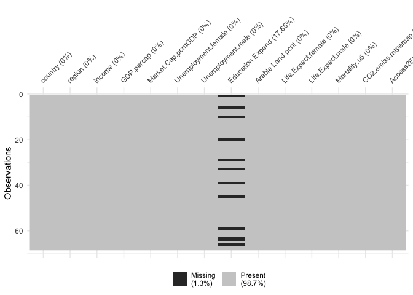

``` r
sum(is.na(dev.inc))
```

    ## [1] 12

The figure below shows the percentage of missing values per region and
income category. Looking at the first row we observe that 100% of the
data is missing from North America and around 75% from South Asia and
25% from Middle East and North Africa. Regarding the second row, we
observe that 40% of the data is missing from lower income countries and
less than 20% from High income countries.

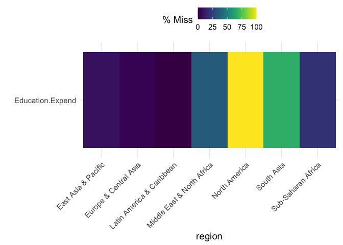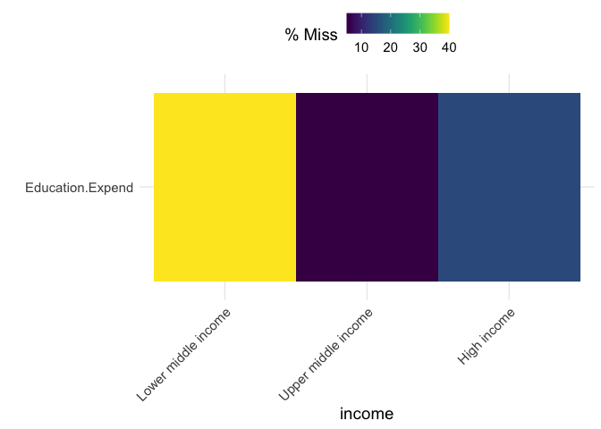

The graph below shows the variable `Education.Expend` plotted againts
`GDP.precap` and `Market.Cap.pcntGDP` by region and income.The missing
values are shown as red dots near the bottom of each panel. We can see
that the missing values exist across the whole range in both of the
graphs and the distribution is similar to the one of the none missing
observations. In particular, in the first graph it can be seen that some
values are clustered in the lower range of GDP. In the second graph, the
missing values are uniformly distributed acrros the x-axis.

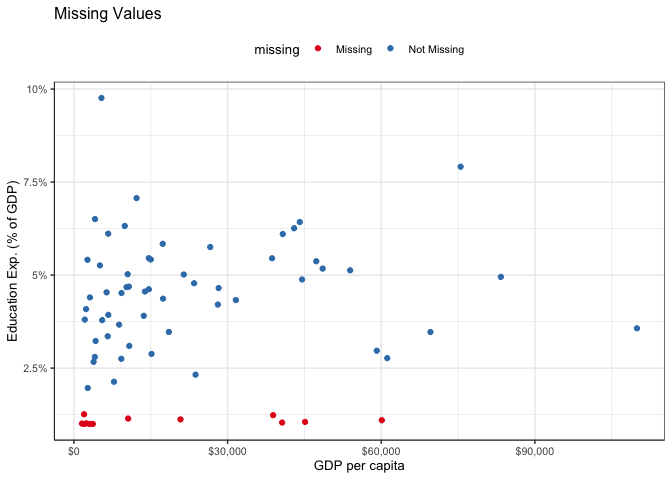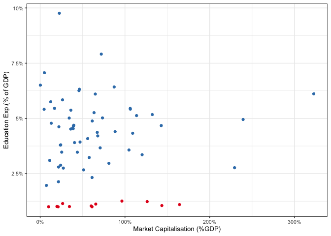

The table below illustrates the missing values grouped per region. The
first column shows the region, the second column shows the missing
variable the third column show the number of missing values and the last
column shows the percentages of missing values per region. We can see
that there isn’t any data about education expenditure for North America,
while 1/3 of the data is missing for South Asia. In addition, 36% and 20
% of values are missing for the Middle East & North Africa and
Sub-Saharan Africa respectfully.
<table>
<thead>
<tr>
<th style="text-align:left;">
region
</th>
<th style="text-align:left;">
variable
</th>
<th style="text-align:right;">
n_miss
</th>
<th style="text-align:right;">
pct_miss
</th>
</tr>
</thead>
<tbody>
<tr>
<td style="text-align:left;">
Middle East & North Africa
</td>
<td style="text-align:left;">
Education.Expend
</td>
<td style="text-align:right;">
5
</td>
<td style="text-align:right;">
35.714286
</td>
</tr>
<tr>
<td style="text-align:left;">
Latin America & Caribbean
</td>
<td style="text-align:left;">
Education.Expend
</td>
<td style="text-align:right;">
0
</td>
<td style="text-align:right;">
0.000000
</td>
</tr>
<tr>
<td style="text-align:left;">
Europe & Central Asia
</td>
<td style="text-align:left;">
Education.Expend
</td>
<td style="text-align:right;">
1
</td>
<td style="text-align:right;">
4.545454
</td>
</tr>
<tr>
<td style="text-align:left;">
East Asia & Pacific
</td>
<td style="text-align:left;">
Education.Expend
</td>
<td style="text-align:right;">
1
</td>
<td style="text-align:right;">
8.333333
</td>
</tr>
<tr>
<td style="text-align:left;">
South Asia
</td>
<td style="text-align:left;">
Education.Expend
</td>
<td style="text-align:right;">
2
</td>
<td style="text-align:right;">
66.666667
</td>
</tr>
<tr>
<td style="text-align:left;">
North America
</td>
<td style="text-align:left;">
Education.Expend
</td>
<td style="text-align:right;">
2
</td>
<td style="text-align:right;">
100.000000
</td>
</tr>
<tr>
<td style="text-align:left;">
Sub-Saharan Africa
</td>
<td style="text-align:left;">
Education.Expend
</td>
<td style="text-align:right;">
1
</td>
<td style="text-align:right;">
20.000000
</td>
</tr>
</tbody>
</table>

Similarly, the table below shows the missing values grouped per income
category.The table is similar to the above with the difference that the
first column shows the income. We observe that approximately the same
number of data is missing from low income and high income countries,
however the number of countries in the low income category is smaller
than the high income and as a result the proportion of missing values is
bigger.

<table>
<thead>
<tr>
<th style="text-align:left;">
income
</th>
<th style="text-align:left;">
variable
</th>
<th style="text-align:right;">
n_miss
</th>
<th style="text-align:right;">
pct_miss
</th>
</tr>
</thead>
<tbody>
<tr>
<td style="text-align:left;">
High income
</td>
<td style="text-align:left;">
Education.Expend
</td>
<td style="text-align:right;">
5
</td>
<td style="text-align:right;">
15.15152
</td>
</tr>
<tr>
<td style="text-align:left;">
Upper middle income
</td>
<td style="text-align:left;">
Education.Expend
</td>
<td style="text-align:right;">
1
</td>
<td style="text-align:right;">
5.00000
</td>
</tr>
<tr>
<td style="text-align:left;">
Lower middle income
</td>
<td style="text-align:left;">
Education.Expend
</td>
<td style="text-align:right;">
6
</td>
<td style="text-align:right;">
40.00000
</td>
</tr>
</tbody>
</table>

Those observations indicate that MCAR (Missing completely at random)
does not apply to this variable, and we would need to consider the
missing data to be either MAR or MNAR. MAR (Missing at random) assumes
that we can predict the missing value based on the rest of the data.By
conditioning on income, we can find that the resulting univariate
distributions (for each of the other variables) appear similar for those
observations for which ed.exp is missing as for those for which it is
not. Hence, missingness appears to be explained by an observed variable
(income), and not an unobserved variable. This suggests MAR more
appropriate than MNAR.

We chose to drop the column Education Expenditure, as we lack all data
for North America and a significant proportion of South Asia.

``` r
#Select Education.Expend and remove rows containing NA
ed.exp<-dev.inc %>%select(country,Education.Expend) %>% na.omit
#Remove Education Expenditure
dev.inc<-dev.inc %>%select(-Education.Expend)
#Select Numeric Data
num.data<-dev.inc %>% 
  select_if(is.numeric)
```

### Outliers and Errors

Next, we move on finding outliers.The below figure shows the box plots
for each numeric variable in the data set. The red points are the
outliers. We can see that all the variables have some observations that
deviate from the rest, but they are not out of bounds (for example
negative or above a normal range) and they make logical sense. This is
expected as those variables describe unique development indicators in
which some countries perform worse or better.

Note: Boxplots aren’t always appropriate for detecting outliers,
particularly if the variables distribution is higly skewed.If we had
noticed some anomalous data we would be worth to choose to investigate
further by visualizing histograms and parfoming the IQR method.


# Exploration of the univariate and multivariate distribution

Up until now we investigate the structure and quality of the data. The
following section presents a brief exploration of the univariate and
multivariate distribution of the data.

## Univariate Analysis

For the univariate analysis we’re to investigate the distribution of the
categorical and numerical variables. The bellow figure shows the number
of variables in each category on the left plot, the violin plots of the
numerical variables on the centre plot, and the histogram of education
expenditure on the right plot. We notice that a lot of countries are
classified as high income, followed by upper middle income. and the
majority are located in Europe and South Asia and the Middle East and
North Africa.

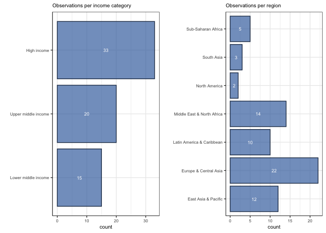
The next table shows the summary statistics of each variable. It’s
interesting to note that for the variable GPD per capital, the
difference between the mean and the median is quite significant. This
caused by the countries with the highest GDPs.

    ##    GDP.percap     Market.Cap.pcntGDP Unemployment.female Unemployment.male
    ##  Min.   :  1564   Min.   :  0.2076   Min.   : 0.639      Min.   : 0.062   
    ##  1st Qu.:  5482   1st Qu.: 24.1902   1st Qu.: 4.198      1st Qu.: 3.708   
    ##  Median : 13747   Median : 46.6438   Median : 6.069      Median : 5.359   
    ##  Mean   : 22719   Mean   : 64.3540   Mean   : 8.844      Mean   : 6.556   
    ##  3rd Qu.: 38737   3rd Qu.: 82.6290   3rd Qu.:10.940      3rd Qu.: 8.414   
    ##  Max.   :109921   Max.   :322.7110   Max.   :29.283      Max.   :25.220   
    ##  Arable.Land.pcnt  Life.Expect.female Life.Expect.male  Mortality.u5    
    ##  Min.   : 0.2239   Min.   :54.84      Min.   :53.09    Min.   :  2.400  
    ##  1st Qu.: 4.2209   1st Qu.:77.59      1st Qu.:71.99    1st Qu.:  4.275  
    ##  Median :11.8564   Median :79.94      Median :75.00    Median :  8.000  
    ##  Mean   :15.8681   Mean   :79.23      Mean   :74.29    Mean   : 14.359  
    ##  3rd Qu.:23.0358   3rd Qu.:83.90      3rd Qu.:78.92    3rd Qu.: 15.250  
    ##  Max.   :59.5938   Max.   :87.26      Max.   :81.60    Max.   :122.500  
    ##  CO2.emiss.mtpercap Access2Elec.pcnt
    ##  Min.   : 0.4248    Min.   : 52.50  
    ##  1st Qu.: 2.4907    1st Qu.: 99.68  
    ##  Median : 4.7417    Median :100.00  
    ##  Mean   : 6.6313    Mean   : 96.52  
    ##  3rd Qu.: 8.1760    3rd Qu.:100.00  
    ##  Max.   :32.1794    Max.   :100.00

Next,the figure below shows the violin plots for the numeric variables.
Except for the variables describing life expectancy, all of the numeric
variable distributions are positively skewed. Life expectancy appears to
have a bimodal distribution, as evidenced by the presence of two peaks.
Most of the observations for the variable Access to Electricity Access
to Electricity are gathered around 100%, with a portion of them ranging
between 50% and 100%. Finally, the distribution of Education Expenditure
is nearly normal, with two outliers on the right.
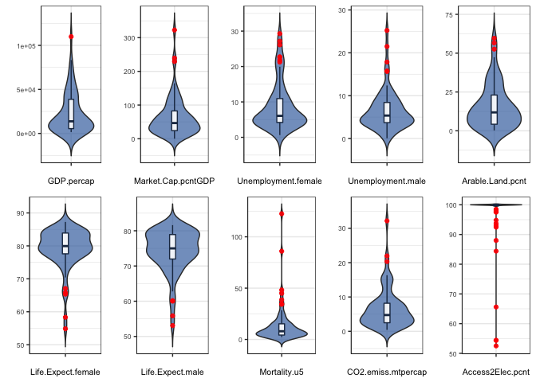
Finally we’re going to look into the distribution of Education
Expenditure.%. The distribution is close to normal, and there are two
outliers on the right.
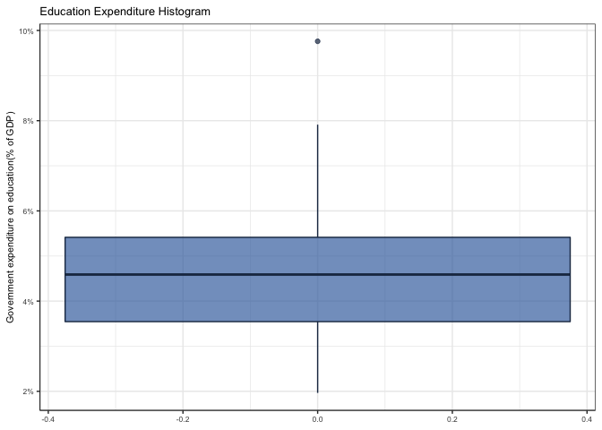

## Multivariate Analysis

The figure below is visual representation of the multivariate
correlation structure and their significance levels. The heatmap shows
the pairwise Pearson correlation coefficients between the variables. The
variables which do not have a significant correlation are left blank. We
observe that:

-   Mortality has a very high negative correlation with access to
    electricity and lives expectancy of both genders.
-   Arable Land is not strongly correlated with any other variable.
-   Unemployment rate for males and females are strongly correlated with
    each other.
-   CO2 consumption has a moderate positive correlation with GDP per cap
    while GDP per capita has a moderate positive correlation with life
    expectancy.
-   Live expectancy for both genders are very highly positively
    correlated with each other and access to electricity.

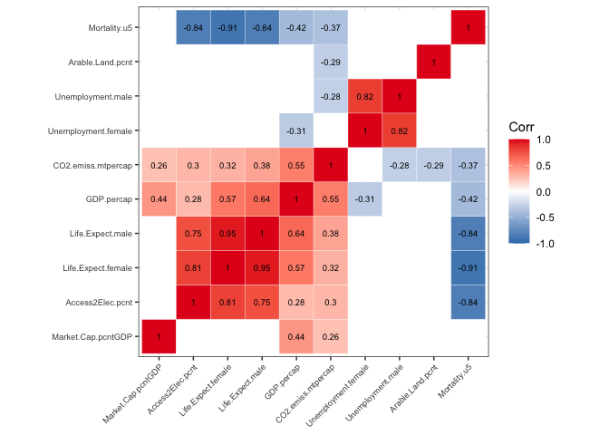
Based on the observations above, we are going to investigate the
relationship between the variables that display strong correlations. In
particular, we’re going to investigate:

-   Income Categories and the relationship with GDP per capita (current
    USD) and market capitalization of domestic listed companies (% of
    GDP).Moreover we’re going to look at the number of countries in each
    income category for each section and display the maps that show the
    GDP per capita and Market Cap globally for each country.
-   CO2 consumption per capita and the relationship with GDP per capita
    and income categories.
-   Unemployment rate by gender for each country and region. In addition
    we’re going to explore how it’s related to income categories and GDP
    per capita.
-   Life expectancy by gender for each country and region. In addition
    we’re going to explore how it’s related to GDP per capita and Market
    Cap.
-   Mortality and the relationship with female life expectancy and
    access to electricity.
-   Percentage of access to electicity globally for each country.
-   Arable land globally for each country.
-   Education Expenditure globally for each country.

### Income Categories

First, we are going to explore the relationship between income
categories, GDP per capita (current USD) and market capitalization of
domestic listed companies (% of GDP).
<table>
<thead>
<tr>
<th style="text-align:left;">
income
</th>
<th style="text-align:right;">
maxGDP
</th>
<th style="text-align:right;">
minGDP
</th>
<th style="text-align:right;">
maxMarketCap
</th>
<th style="text-align:right;">
minMarketCap
</th>
</tr>
</thead>
<tbody>
<tr>
<td style="text-align:left;">
Lower middle income
</td>
<td style="text-align:right;">
5520.315
</td>
<td style="text-align:right;">
1563.768
</td>
<td style="text-align:right;">
96.39883
</td>
<td style="text-align:right;">
0.2076133
</td>
</tr>
<tr>
<td style="text-align:left;">
Upper middle income
</td>
<td style="text-align:right;">
15146.409
</td>
<td style="text-align:right;">
4231.518
</td>
<td style="text-align:right;">
322.71098
</td>
<td style="text-align:right;">
4.9751435
</td>
</tr>
<tr>
<td style="text-align:left;">
High income
</td>
<td style="text-align:right;">
109921.031
</td>
<td style="text-align:right;">
13629.290
</td>
<td style="text-align:right;">
239.39652
</td>
<td style="text-align:right;">
12.3405769
</td>
</tr>
</tbody>
</table>
The figure below displays the relationship between GDP per capita and
Market cap for each income category.We observe the relationship is
linear and because of South Africa’s Market Cap the trending line is
curved at the end.
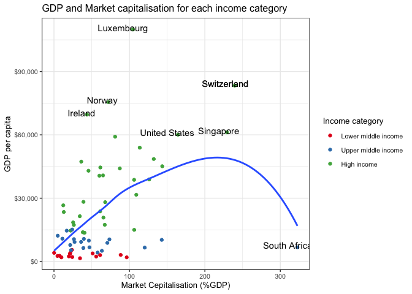
The figure below provides a breakdown of the number of counties in each
category for each region. We observe that all countries are categorized
as high income in North America and lower middle income in South Asia.It
can be seen that there is there is no country in the high income
category in Sub-Saharan Africa and in contrast there is no country
categorized as lower middle income in Latin America & Caribbean and
North America.Finally, in all the other regions there are countries
categorized in all income levels.The majority of the countries in Europe
and Central Asia are in the high income category whereas there is only 1
country is in the lower middle income, which in the next code section we
find is Ukraine.In addition, in the Middle East & North Africa we see
some inequality as countries are either in the highest or lower category
with only two in the middle. Finally, in East Asia& Pacific, countries
are spread more equally.
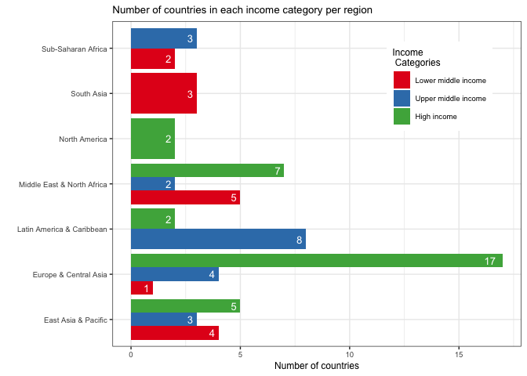
We’re going to filter the data to investigate which country in Europe
and Central Asia is in the lower income category.
<table>
<thead>
<tr>
<th style="text-align:left;">
country
</th>
<th style="text-align:left;">
region
</th>
<th style="text-align:left;">
income
</th>
</tr>
</thead>
<tbody>
<tr>
<td style="text-align:left;">
Ukraine
</td>
<td style="text-align:left;">
Europe & Central Asia
</td>
<td style="text-align:left;">
Lower middle income
</td>
</tr>
</tbody>
</table>

This map shows the GDP per capita and Market Capitalisations in every
country globally.
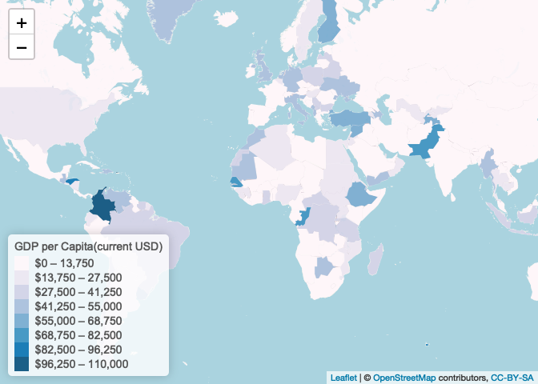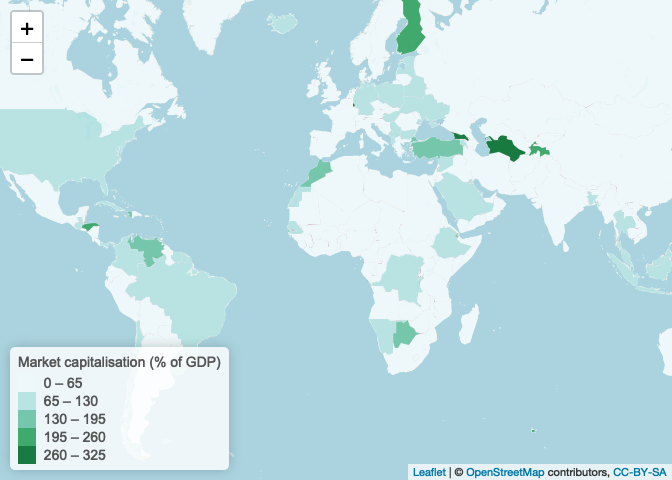

### CO2 and income

The first plot shows a violin plot of CO2 emissions per income category.
We can see that the mean CO2 consumption doesn’t differ a lot between
different categories, but as we move up the categories, the range of the
distirbution increases. The second graph shows the relationship between
CO2, GDP per capita, and income category. The coloured dashed lines show
the mean value of CO2 emissions for each income category. The countries
in the high-income category produce the most CO2 emissions. There are
nine countries producing more than 15 metric tons per capita, whilst
most of the countries’ emissions stay below 10 tons per capita. These
graphs also give us the opportunity to see how GDP per capita is
distributed in each income category. While the observations in the upper
and lower income categories cover a narrow range and are gathered below
20,000 dollars, the values in the high-income category are more
dispersed and cover a range that is more than triple that of the other
two categories.The curve increases gradually until about 12 tons/capita
and shows that as GPD increases, CO2 emissions increase at a slower
rate.
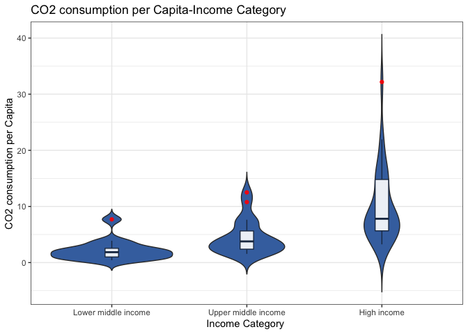

    ## `geom_smooth()` using formula 'y ~ x'

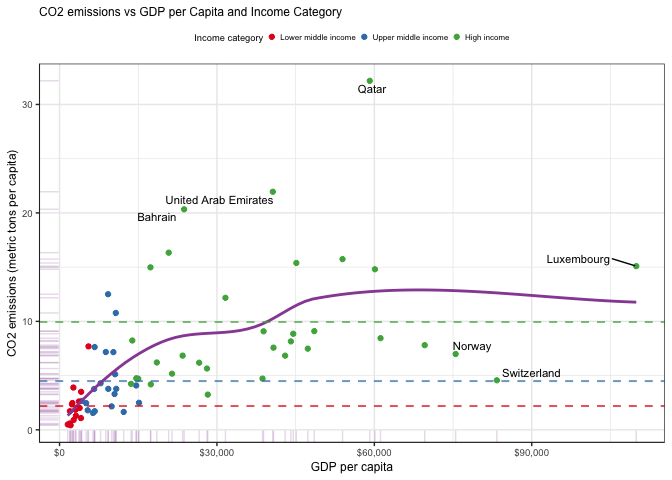

### Unemployement by gender

The following graphs show the unemployment rates for each gender in each
country and region. In some countries, we observe a high inequality
between genders, especially in United Arab Emirates, Saudi Arabia, and
Bahrain etc. In general, unemployment rates for women are higher than
those for men. The second graph, confirms that indeed, in the Middle
East & North Africa, unemployment rate for females is significantly
higher than it is for men. In addition, in Europe and Central Asia,
there is some inequality between the two genders favouring the males. In
East Asia and the Pacific, the rates for each gender are almost the
same. In all regions, the female unemployment rate is higher except for
North America where it seems the opposite is happening.
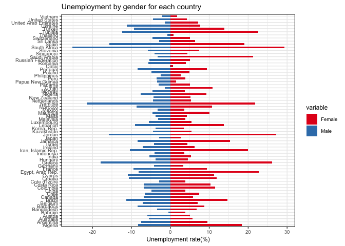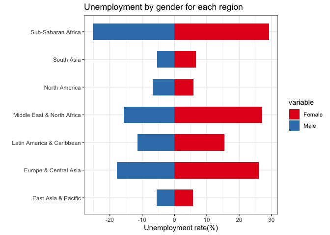
The maps show the unemployment rate by gender globally, for each
country.
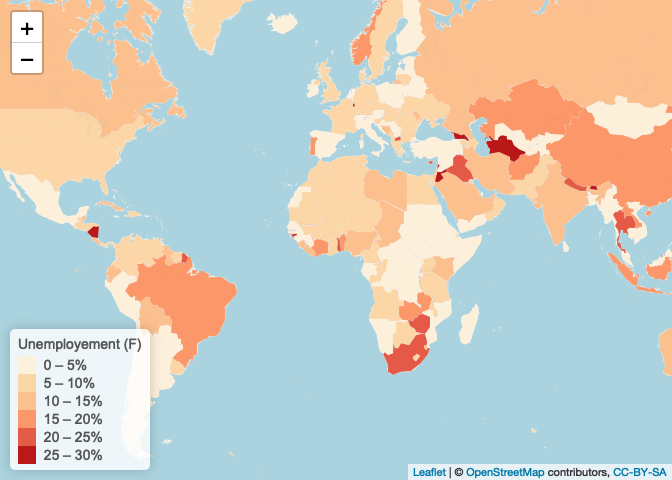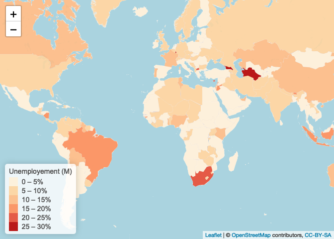
The figure below shows the unemployment rate by gender for each income
category. For all income categories, the unemployment rate for females
is higher than for males. The highest difference can be observed in
countries classified as lower middle income and the lowest difference
can be seen in the upper-middle-income category.
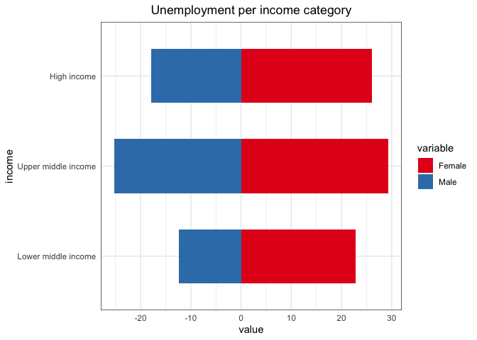

The figure below shows the relationship between the unemployment rate
for each gender and GDP per capita for each income category. The colour
of each point describes the income category, and the black dashed line
shows the mean value of the unemployment rate for each gender. What
stands out first in this graph, is the difference in mean values, where
the mean unemployment rate for females is higher than for males. We can
also see that the two trending lines follow the same trend for both
genders, suggesting that as GDP increases, the rate decreases. However,
the employment rate for males doesn’t seem to be affected by GDP per
capita as much since it’s almost straight. Moreover, the trend line in
the plot that represents females displays an increase, but the points
seem to be in the same range. Finally, countries in the upper and
lower-middle categories, with some exceptions, have the highest
unemployment rates. It is surprising to see that some counties in the
higher income category have the same unemployment rate as countries in
the upper and lower-middle categories.

    ## `geom_smooth()` using formula 'y ~ x'

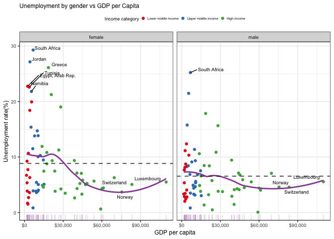
\### Life expectancy by gender

The first graph below shows life expectancy by gender for each country.
It can be seen that for the majority of countries, life expectancy for
both genders is above 50 years. The second graph shows life expectancy
by gender for each region. We can observe that the life expectancy for
males is higher than 75, apart from in Sub-Saharan Africa and South
Asia, where it’s close to 65. In almost all regions, female life
expectancy is higher than males . Finally, the last graph shows life
expectancy by gender for each income category. There isn’t a significant
difference between the categories, and again, life expectancy is higher
for females.
<table>
<thead>
<tr>
<th style="text-align:left;">
</th>
<th style="text-align:left;">
Life.Expect.female
</th>
<th style="text-align:left;">
Life.Expect.male
</th>
</tr>
</thead>
<tbody>
<tr>
<td style="text-align:left;">
</td>
<td style="text-align:left;">
Min. :54.84
</td>
<td style="text-align:left;">
Min. :53.09
</td>
</tr>
<tr>
<td style="text-align:left;">
</td>
<td style="text-align:left;">
1st Qu.:77.59
</td>
<td style="text-align:left;">
1st Qu.:71.99
</td>
</tr>
<tr>
<td style="text-align:left;">
</td>
<td style="text-align:left;">
Median :79.94
</td>
<td style="text-align:left;">
Median :75.00
</td>
</tr>
<tr>
<td style="text-align:left;">
</td>
<td style="text-align:left;">
Mean :79.23
</td>
<td style="text-align:left;">
Mean :74.29
</td>
</tr>
<tr>
<td style="text-align:left;">
</td>
<td style="text-align:left;">
3rd Qu.:83.90
</td>
<td style="text-align:left;">
3rd Qu.:78.92
</td>
</tr>
<tr>
<td style="text-align:left;">
</td>
<td style="text-align:left;">
Max. :87.26
</td>
<td style="text-align:left;">
Max. :81.60
</td>
</tr>
</tbody>
</table>

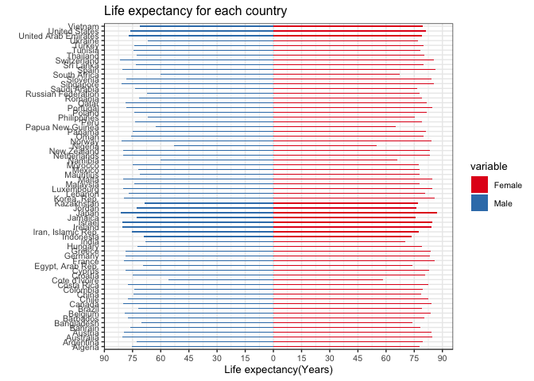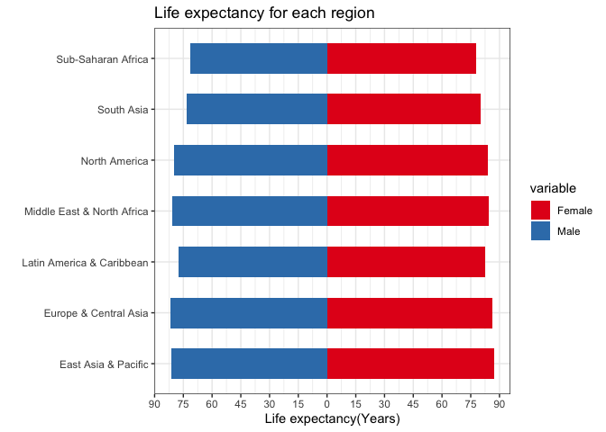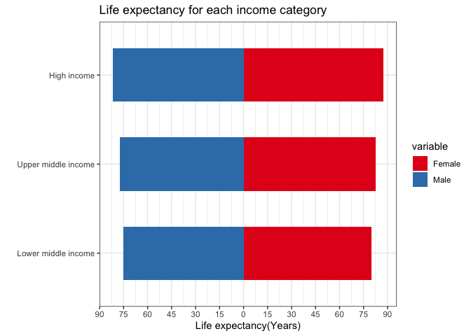

The graph shows the relationship between life expectancy for each gender
and GDP per capita. The colour of each point depends on the market
capitalisation percentage, and the two black dashed lines indicate the
mean life expectancy of each gender. We observe that the two variables
have a curvilinear relationship where when GDP per capita increases,
life expectancy also increases, but at a different rate. In the
beginning, it rises at a rapid rate, and then, beyond a point, the line
flattens out. Life expectancy for males is lower in almost all countries
than it is for women, which is shown by the lower mean value as well. We
can also see that life expectancy increases in accordance with market
capitalisation. The only exception is South Africa, where market
capitalisation reached 300%. The life expectancy for women and men is
approximately 68 and 60, respectively.

    ## `geom_smooth()` using formula 'y ~ x'

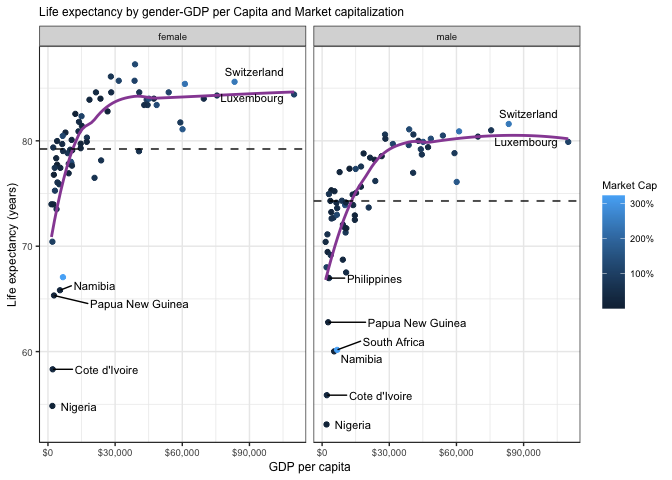

### Mortality

The graph shows the relationship between female life expectancy, the
mortality rate, and access to electricity. The colour of the points
indicates the electricity access percentage, and the two dashed lines
show the mean value of life expectancy and mortality. As we mentioned
above, those variables are highly correlated and, indeed, we can observe
an almost negative linear relationship. Most of the countries are
gathered around the top left of the graph, and only a few points are
scattered away. Thus, the mean value for female expectancy is around 80
years old, and the mean mortality is equal to 13 deaths per 1000 live
births. We can also see that as the mortality rate increases, access to
electricity decreases steadily.

    ## `geom_smooth()` using formula 'y ~ x'

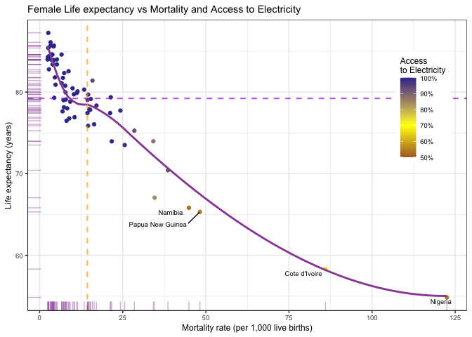
The next map shows the mortality rate which is the deaths under 5 years
per 1000 live births in each country.

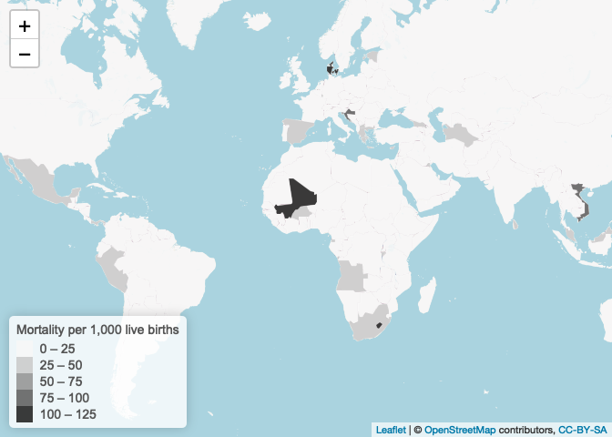

### Access to electricity Map

The plot below shows only countries with Access to Electricity less than
100%.We can see that all countries are categorised as either lower or
upper middle income.
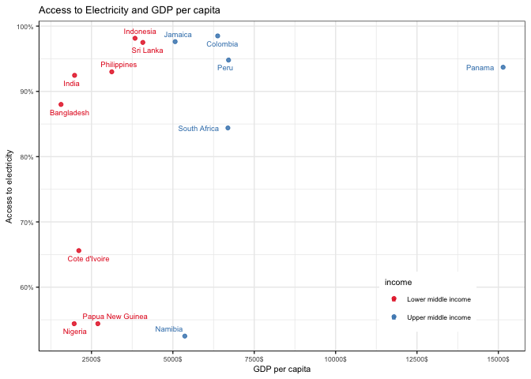

### Arable Land Map

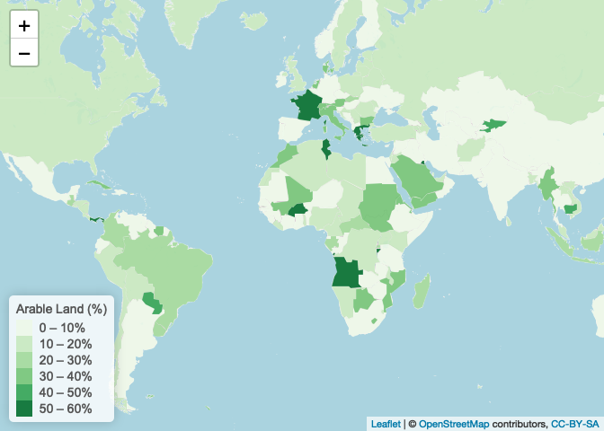

### Education expenditure Map

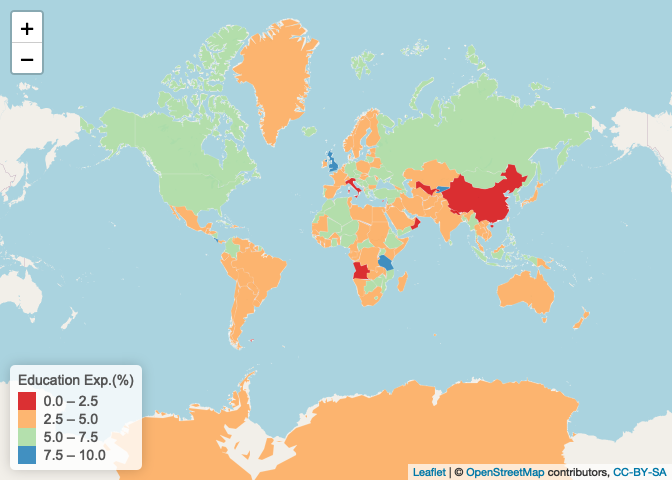

In the next part we’re going determine any clustering behaviour, which
will then be investigated further using various dimension reduction and
clustering methods.
